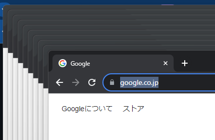

# 複数ブラウザを同時に起動して負荷テストを行うためのスクリプト(PlayWrightを利用)

## はじめに
[PlayWright](https://playwright.dev/)を利用して、指定したURLに並列でアクセスを行うスクリプトです

https://github.com/murasuke/js-stress-test

[Apache Bench](https://httpd.apache.org/docs/2.4/programs/ab.html)や[k6-benchmarks](https://github.com/grafana/k6-benchmarks)のようなベンチマークツールは、cssの読み込みや画面ロード時に発生するjsの描画を含めた時間を計測するのが困難でした。
そのためブラウザを操作して表示にかかる時間を計測するスクリプトを作成しました

* ブラウザを利用して負荷をかけるため、画面のURLを指定すれば、cssやjavascriptファイルも同時に取得します
* 指定した数のブラウザを同時に開き、全ブラウザが読み込み完了する時間を測定します
* jsによる動的な画面描画を待つため、読み込み完了を判断するための文字列(画面に表示されたら完了)を指定することもできます
* ブラウザ毎に繰り返す回数も指定できます

* 10ブラウザを同時にブラウザを開くとこんな感じになります(動作状況を確認するため、headlessモードはoff)



### ex. 3ブラウザ同時 × 2回繰り返しアクセス（合計6回）を行った場合の実行結果例

* ページオープンにかかった時間の平均、最小、最大を表示します

```
$ node stress-test.mjs 3 https://www.google.co.jp/  2 
param1 URL     : https://www.google.co.jp/
param2 open    : 3 browsers
param3 repeat  : 2 times
param4 delay   : 0 ms (For opening the next browser)
param5 selector:  (For checking page loading completion)
====== start : 08:44:59.044 ======
#1-1 time: 1417ms
#2-1 time: 1418ms
#3-1 time: 1505ms
#1-2 time: 691ms
#2-2 time: 683ms
#3-2 time: 746ms
====== end:08:45:01.624 ======

******** result ********
mean:1076.67(ms) min: 683(ms) max:1505(ms)
{
  sequence: [
    { browser: 1, times: 1, duration: 1417, endTime: '08:45:00.493' },
    { browser: 2, times: 1, duration: 1418, endTime: '08:45:00.495' },
    { browser: 3, times: 1, duration: 1505, endTime: '08:45:00.582' },
    { browser: 1, times: 2, duration: 691, endTime: '08:45:01.353' },
    { browser: 2, times: 2, duration: 683, endTime: '08:45:01.368' },
    { browser: 3, times: 2, duration: 746, endTime: '08:45:01.479' }
  ],
  durations: [ [ 1417, 691 ], [ 1418, 683 ], [ 1505, 746 ] ]
}
```
## 概要説明

### ブラウザを複数同時に開く

同一[context](https://playwright.dev/docs/api/class-browsercontext)内で複数[ページ](https://playwright.dev/docs/api/class-page)を開く(タブを追加する)と、TCPコネクションを共有してしまうため、contextレベル(別ウィンドウを開く)で分離します

* `browser.newContext()`でブラウザウィンドウを開き、`context.newPage()`タブを生成するイメージです

```javascript
const contexts = [];
for (let i = 0; i < parallelCount; i++) {
    const context = await browser.newContext();
    const page = await context.newPage();
    contexts.push({i: i+1, context, page, delay: i * execDelay});
}
```

### 複数のウィンドウを同時に操作する

* awaitを利用すると複数を並列で実行することができないため、Promiseを返して、then()で数珠繋ぎしながら実行します
* ページ読み込みが終わったら、処理を指定回数繰り返すため、再帰呼び出しを利用します(procedure()関数)

詳細は下記のコメント参照
* 「//※ 」で始まるコメントは説明用に追記したコメント
* 一部本筋と関係ない処理(ログ等)は削除

```javascript
for (let {i, page, context, delay} of contexts) {
    // ※proceduresは、全処理が完了するのを待ち合わせるために利用
    procedures.push(new Promise( (resolve)  => {
        const procedure = (times) => {
            if (times > repeatCount) {  // ※再帰呼び出しでtimesに実行回数が入っているので終了チェックを行う
                // 指定回数実行したら終了
                resolve();
                return context.close();
            }

            // 指定秒ごとに開く
            setTimeout(delay).then(() => { // ※delayで実行開始するまでの待ち時間を指定(0だと一斉にアクセスする。0以上にすればWebサーバーのプロセスの枯渇を防いで初回処理が早くなる場合がる)
                return page.goto(targetURL); 
            }).then(
                // (waitSelectorが指定された場合は)表示されるまで待つ(jsによる動的な画面描画を待つ) //※ 未指定であればページロード完了まで待つ
                () => waitSelector ? page.locator(`text=${waitSelector}`).innerHTML(): ''
            ).then(() => {
                // 画面表示完了にかかった時間を表示
                // ※ 一旦画面をクリア
                return page.goto('about:blank');
            }).then(() => {
                // 再度表示　//※ 処理完了したら、指定回数繰り返すため再帰呼び出しを行う(引数：呼び出し回数+1)
                return procedure(++times);
            });
        };
        procedure(1);
    }));
}

// 全処理が完了したら後始末 //※ ブラウザを閉じる
Promise.all(procedures).then(() => {
    return browser.close();
});
```

### 引数仕様
    1：同時に開くブラウザ数
        未指定時は:PARALLEL_COUNT (両方未指定の場合:1)
    2：対象URL 
    　　 未指定時は環境変数：STRESS_TARGET_URL (両方未指定時はPG終了)
    3: 1ブラウザあたりの繰り返し回数
        未指定時は環境変数：REPEAT_COUNT (両方未指定の場合:1)
    4：ブラウザ読み込みをずらす時間(ms) 
        未指定時は環境変数：OPEN_DELAY (両方未指定の場合:0)
    5：読み込み完了を判断するための文字列(未指定時はページが開けたら完了)
        未指定時は環境変数：RENDER_WAIT_SELECTOR（省略可）


### ソース

```javascript
/**
 * 負荷テスト用スクリプト 
 * ・指定した数のブラウザで、対象ページを指定回数開き、ページ読み込みにかかった時間を出力する
 * ・引数の代わりに環境変数(.env)で指定も可能
 * 引数
 *   1：同時に開くブラウザ数
 *      未指定時は:PARALLEL_COUNT (両方未指定の場合:1)
 *   2：対象URL 
 * 　　 未指定時は環境変数：STRESS_TARGET_URL (両方未指定時はPG終了)
 *   3: 1ブラウザあたりの繰り返し回数
 *      未指定時は環境変数：REPEAT_COUNT (両方未指定の場合:1)
 *   4：ブラウザ読み込みをずらす時間(ms) 
 *      未指定時は環境変数：OPEN_DELAY (両方未指定の場合:0)
 *   5：読み込み完了を判断するための文字列(未指定時はページが開けたら完了)
 *      未指定時は環境変数：RENDER_WAIT_SELECTOR（省略可）
 */
import { setTimeout } from 'timers/promises';
import {chromium} from 'playwright';
import * as dotenv from 'dotenv'
dotenv.config(); // .env初期化

const getArgs = (i, def) => process.argv.length > i ? process.argv[i]: def;
const formatHMS = (timestamp) => {
    return (new Date(timestamp)).toLocaleString('ja-JP',{
        hour: '2-digit',
        minute: '2-digit',
        second: '2-digit',
        fractionalSecondDigits: 3,
    });
}

// 引数1: 並列実行数
const parallelCount = parseInt(getArgs(2, process.env.PARALLEL_COUNT ?? 1), 10);
// 引数2: 対象URL
const targetURL = getArgs(3, process.env.STRESS_TARGET_URL);
// 引数3: 繰り返し回数
const repeatCount = getArgs(4, process.env.REPEAT_COUNT ?? 1);
// 引数4: 実行ディレイ
const execDelay = parseInt(getArgs(5, process.env.OPEN_DELAY ?? 0));
// 引数5: 読み込み完了を判断するための文字列
const waitSelector = getArgs(6, process.env.RENDER_WAIT_SELECTOR ?? '');

// 対象URLがなければ終了
if (!targetURL) {process.exit(0)};

console.log(`param1 URL     : ${targetURL}`);
console.log(`param2 open    : ${parallelCount} browsers`);
console.log(`param3 repeat  : ${repeatCount} times`);
console.log(`param4 delay   : ${execDelay} ms (For opening the next browser)`);
console.log(`param5 selector: ${waitSelector} (For checking page loading completion)`);

// chrome(headless: false)で起動
const browser = await chromium.launch({ headless: false });

// ブラウザを開く
// ・同一context内で複数ページを開くと、TCPコネクションを共有してしまうため、contextレベルで分離する
const contexts = [];
// 実行結果保持用
const results = {sequence: [], durations: []};
for (let i = 0; i < parallelCount; i++) {
    const context = await browser.newContext();
    const page = await context.newPage();
    page.setDefaultTimeout(120*1000);
    contexts.push({i: i+1, context, page, delay: i * execDelay});
    results.durations.push([]);
}

// 実行結果を追加
const addLog = (i, times, duration, endTime) => {
    results.sequence.push({browser:i, times, duration, endTime:formatHMS(endTime)})
    results.durations[i-1].push(duration);
}

// 全ブラウザの処理完了を管理する(Promise)ための配列
let procedures = [];

console.log(`====== start : ${formatHMS(Date.now())} ======`);
// ページ表示にかかった時間を、画面毎に表示する
// 並行で実行させるためawaitを使わない
for (let {i, page, context, delay} of contexts) {
    procedures.push(new Promise( (resolve)  => {
        const procedure = (times) => {
            if (times > repeatCount) {
                // 指定回数実行したら終了
                resolve();
                return context.close();
            }

            let startTime = 0; // 開始時刻
            // 指定秒ごとに開く
            setTimeout(delay).then(() => { 
                startTime = Date.now();
                return page.goto(targetURL); 
            }).then(
                // (waitSelectorが指定された場合は)表示されるまで待つ(jsによる動的な画面描画を待つ)
                () => waitSelector ? page.locator(`text=${waitSelector}`).innerHTML(): ''
            ).then(() => {
                // 画面表示完了にかかった時間を表示
                const endTime = Date.now() ;
                const duration = endTime - startTime;
                console.log(`#${i}-${times} time: ${duration}ms`);
                addLog(i, times, duration, endTime);
                return page.goto('about:blank');
            }).then(() => {
                // 再度表示
                return procedure(++times);
            });
        };
        procedure(1);
    }));
}

const dumpResult = (results) => {
    const durations = results.sequence.map(x => x.duration);
    let mean = (durations.reduce((x, y) => x + y) / durations.length).toFixed(2);
    let min = Math.min(...durations);
    let max = Math.max(...durations);

    console.log(`mean:${mean}(ms) min: ${min}(ms) max:${max}(ms)`);
    console.log(results);
}

// 全処理が完了したら後始末
Promise.all(procedures).then(() => {
    console.log(`====== end:${formatHMS(Date.now())} ======`);
    console.log('\n******** result ********');
    dumpResult(results);
    return browser.close();
});

```